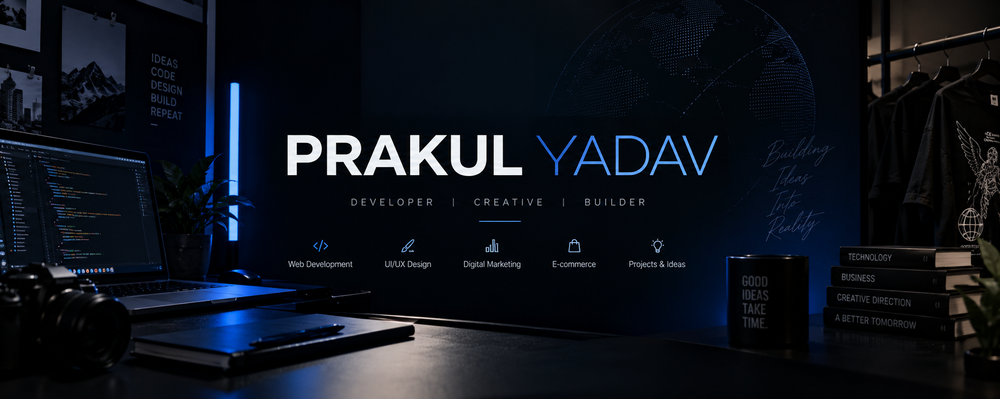

# PRAKUL YADAV

### Founder · Full-Stack Web Developer · Digital Brand Builder

  

  
  
  

  <b>Code with purpose. Design with intent. Build for impact.</b>

---

## 👋 About Me

I'm **Bhavishya Yadav**, a founder, full-stack web developer, and digital brand builder passionate about turning ideas into useful digital products.

My work brings together software development, UI/UX design, e-commerce experiences, and performance marketing. I enjoy building websites, experimenting with technology, creating digital brands, and continuously improving my technical and problem-solving skills.

- 💻 Building modern, responsive web applications and websites.
- 🎨 Designing intuitive interfaces and thoughtful digital experiences.
- 🛍️ Exploring e-commerce, storefront development, and digital branding.
- 📈 Working with performance marketing concepts, including Google Ads and Meta Ads.
- 🐍 Strengthening my Python fundamentals through hands-on practice.
- 🌱 Exploring AI, automation, and technology-driven solutions.
- 🚀 Learning by building, testing, debugging, and shipping projects.

> I believe great products come from combining strong engineering, thoughtful design, and a clear understanding of the people using them.

## 🛠️ Skills & Technologies

### Development

  

### Tools & Platforms

  

### Other Areas

- **UI/UX Design:** Responsive layouts, visual design, user experience, and interface prototyping.
- **E-commerce:** Shopify storefronts, product pages, shopping experiences, and online store customization.
- **Digital Marketing:** Google Ads, Meta Ads, campaign optimization, and performance-focused marketing.
- **Software Development:** Programming fundamentals, debugging, database integration, and custom software solutions.
- **Creative Technology:** Exploring AI, automation, 3D web experiences, and interactive interfaces.

*My toolkit evolves as I build new projects and deepen my experience.*

## 🚀 Featured Projects

### ⚔️ Code Crusade

**Python learning & problem-solving**

A growing collection of Python exercises and beginner programs documenting my journey through programming fundamentals.

- Variables, conditions, loops, and functions
- Number problems and string manipulation
- Palindromes, Fibonacci, prime numbers, and factorials
- Practice through debugging and dry runs

🔗 **[Explore Code Crusade](https://github.com/Prakulyadav/Codecrusade)**

### 👕 The Oversize Hub

**Streetwear e-commerce & digital brand building**

A fashion e-commerce project focused on a premium oversized-fashion aesthetic, product presentation, responsive frontend design, and shopping experience.

- Premium, minimal visual identity
- Responsive storefront and product experiences
- E-commerce interface and user experience
- Brand-focused digital design

🔗 **[Visit The Oversize Hub](https://theoversizehub.com/)**

### 🌱 GrowSense

**Smart greenhouse automation · IoT · AI**

An intelligent greenhouse automation concept exploring how connected sensors, automation, and AI can support smarter agricultural environments.

- Smart greenhouse monitoring concepts
- Sensor-driven automation
- AI-assisted agricultural technology
- Dashboard and product experience design

### 🛍️ HXTN

**Fashion e-commerce & web development**

An earlier fashion e-commerce project exploring oversized clothing, bold creative direction, custom storefronts, and digital shopping experiences.

### 🧮 Python Mini Projects

A collection of practical beginner projects, including:

- Calculator
- Hotel management and billing
- Leap year checker
- Number reversal
- Assignments and revision exercises

Explore the programs in **[Code Crusade](https://github.com/Prakulyadav/Codecrusade)**.

## 📊 GitHub Activity

  
  

  

## 🎯 What I'm Working Towards

- [ ] Build more complete, production-ready applications.
- [ ] Strengthen Python, data structures, and algorithms.
- [ ] Improve software architecture and database skills.
- [ ] Develop more polished and accessible user interfaces.
- [ ] Explore AI-powered applications and automation.
- [ ] Build and document meaningful open-source projects.
- [ ] Maintain consistent, genuine development progress.

## 🌐 Beyond the Code

I enjoy exploring the intersection of technology, business, design, and marketing. Whether it's building a web application, improving an online store, experimenting with automation, or developing a digital brand, I like taking ideas from concept to execution.

**Languages:** English · Hindi · Punjabi

## 🤝 Let's Connect

I'm open to connecting with developers, founders, designers, and people building interesting things.

  
  
  

---

  <b>Build things that matter. Keep learning. Never stop improving.</b>
    
  <i>Thanks for visiting my profile! ⭐</i>

